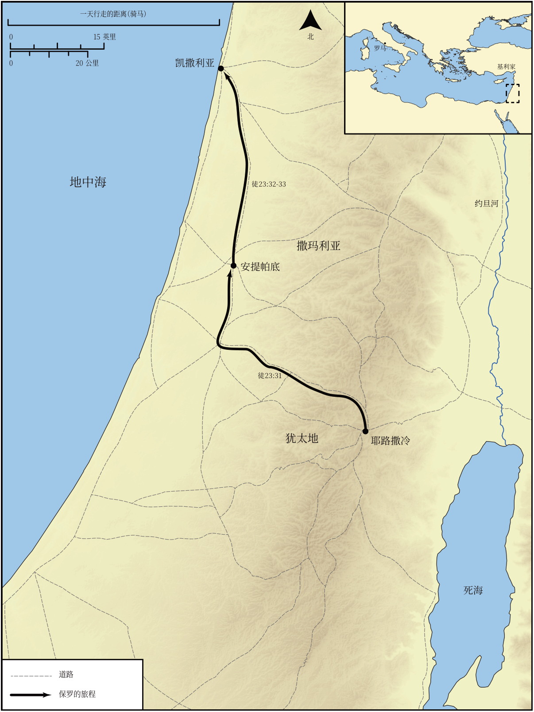

# Biblica 开放圣经地图

## License Information

Biblica Open Bible Maps, © 2023–2025 Biblica, Inc. This work is licensed under Creative Commons Attribution-ShareAlike 4.0 International (https://creativecommons.org/licenses/by-sa/4.0/). More Information: https://docs.google.com/document/d/1Pp44yZ0Zdnd59vJHTrt2rPYq0SppfX5rZbPBt6mz37U/edit?tab=t.0#heading=h.oev9aj1ksvk2

--------------------------------

## 保罗与早期教会：保罗被捕并押送至该撒利亚 (id: NT047)

### Image Content

[link](images/NT047.png)

* **Associated Passages:** 使徒行传 23:1-35

* **Associated ACAI Concepts:** Paul (ID: `person:Paul`); Pharisees (ID: `group:Pharisee`); LORD (ID: `deity:Lord`); Jews (ID: `group:Jews`); Sadducees (ID: `group:Sadducee`); Felix (ID: `person:Felix`); Rome (ID: `place:Rome`); Ask for (ID: `keyterm:AskFor`); An Angel (ID: `deity:Angel`); Resurrection (ID: `keyterm:Resurrection`); Caesarea (ID: `place:Caesarea`); Decided (ID: `keyterm:Decided`); Law (ID: `keyterm:Law`); Ananias (ID: `person:Ananias.3`); Antipatris (ID: `place:Antipatris`); Lysias (ID: `person:Lysias`); Cilicia (ID: `place:Cilicia`); Cheer Up (ID: `keyterm:CheerUp`); Military Member (ID: `person:MilitaryMember`); Declare (ID: `keyterm:Declare`); Hope (ID: `keyterm:Hope`); Jesus (ID: `person:Jesus.2`); Good (ID: `keyterm:Good`); Bear Witness (ID: `keyterm:BearWitness`); Decision (ID: `keyterm:Decision`); Salvation (ID: `keyterm:Salvation`); Conscience (ID: `keyterm:Conscience`); Rescue (ID: `keyterm:Rescue`); Live (ID: `keyterm:Live.3`); Herod (ID: `person:Herod`); Persuade (ID: `keyterm:Persuade`); A Group of People (ID: `group:GenericGroup`); Promise (ID: `keyterm:Promise`); Fear (ID: `keyterm:Fear`); Jerusalem (ID: `place:Jerusalem`); Disobey (ID: `keyterm:Disobey`); Palace (ID: `realia:Palace`)
