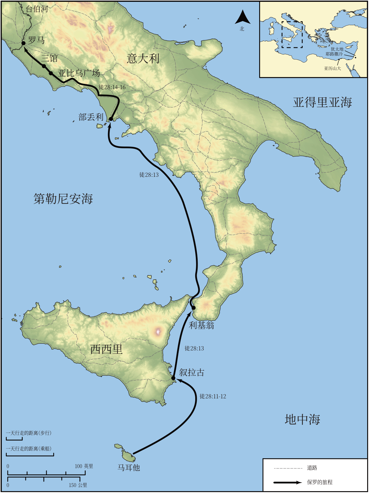

# Biblica 开放圣经地图

## License Information

Biblica Open Bible Maps, © 2023–2025 Biblica, Inc. This work is licensed under Creative Commons Attribution-ShareAlike 4.0 International (https://creativecommons.org/licenses/by-sa/4.0/). More Information: https://docs.google.com/document/d/1Pp44yZ0Zdnd59vJHTrt2rPYq0SppfX5rZbPBt6mz37U/edit?tab=t.0#heading=h.oev9aj1ksvk2

--------------------------------

## 保罗与早期教会：保罗前往罗马的旅程（第二部分） (id: NT049)

### Image Content

[link](images/NT049.png)

* **Associated Passages:** 使徒行传 28:1-31

* **Associated ACAI Concepts:** Paul (ID: `person:Paul`); LORD (ID: `deity:Lord`); Rome (ID: `place:Rome`); Salvation (ID: `keyterm:Salvation`); Publius (ID: `person:Publius`); Persuade (ID: `keyterm:Persuade`); Ask for (ID: `keyterm:AskFor`); Jews (ID: `group:Jews`); Jesus (ID: `person:Jesus.2`); Kingdom (ID: `keyterm:Kingdom`); Three Taverns (ID: `place:ThreeTaverns`); Malta (ID: `place:Malta`); Puteoli (ID: `place:Puteoli`); Alexandria (ID: `place:Alexandria`); Rhegium (ID: `place:Rhegium`); Syracuse (ID: `place:Syracuse`); Forum of Appius (ID: `place:ForumOfAppius`); Word (ID: `keyterm:Word`); Call Upon (ID: `keyterm:CallUpon`); Declare (ID: `keyterm:Declare`); Israel (ID: `person:Israel`); Holy Spirit (ID: `deity:HolySpirit`); Hope (ID: `keyterm:Hope`); Gentiles (ID: `group:Gentile`); Serve (ID: `keyterm:Serve`); Discern (ID: `keyterm:Discern`); Proclaim (ID: `keyterm:Proclaim`); Pray (ID: `keyterm:Pray`); Claudius (ID: `person:Claudius`); Disbelieve (ID: `keyterm:Disbelieve`); Think (ID: `keyterm:Think`); Moses (ID: `person:Moses`); Kindness (ID: `keyterm:Kindness`); Hospitably (ID: `keyterm:Hospitably`); Heart (ID: `keyterm:Heart`); Name (ID: `keyterm:Name`); Be (Or Show Oneself) Just (ID: `keyterm:Just`); Isaiah (ID: `person:Isaiah`); Law (ID: `keyterm:Law`); Life (ID: `keyterm:Life`); Jerusalem (ID: `place:Jerusalem`); Judea (ID: `place:Judea`); Emblem (ID: `realia:Emblem`); Chain (ID: `realia:Chain`); Inn (ID: `realia:Inn`); Guest Room (ID: `realia:GuestRoom`); Cobra (ID: `fauna:Cobra`); Ship (ID: `realia:Ship`); Snake (ID: `fauna:Snake`)
