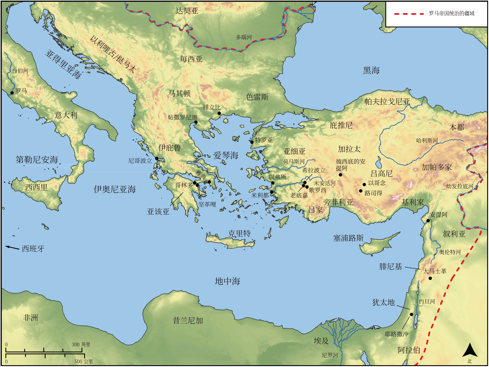

# Biblica 开放圣经地图

## License Information

Biblica Open Bible Maps, © 2023–2025 Biblica, Inc. This work is licensed under Creative Commons Attribution-ShareAlike 4.0 International (https://creativecommons.org/licenses/by-sa/4.0/). More Information: https://docs.google.com/document/d/1Pp44yZ0Zdnd59vJHTrt2rPYq0SppfX5rZbPBt6mz37U/edit?tab=t.0#heading=h.oev9aj1ksvk2

--------------------------------

## 保罗与早期教会：书信概览 (id: NT050)

### Image Content

[link](images/NT050.png)

* **Associated Passages:** 罗马书 1:1-16:27; 哥林多前书 1:1-16:24; 哥林多后书 1:1-13:13; 加拉太书 1:1-6:18; 腓立比书 1:1-4:23; 歌罗西书 1:1-4:18; 帖撒罗尼迦前书 1:1-5:28; 帖撒罗尼迦后书 1:1-3:18; 提摩太前书 1:1-6:21; 提摩太后书 1:1-4:22; 提多书 1:1-3:15; 彼得前书 1:1-5:14; 彼得后书 1:1-3:18; 启示录 1:1-22:21

* **Associated ACAI Concepts:** LORD (ID: `deity:Lord`); Jesus (ID: `person:Jesus.2`); Believe (ID: `keyterm:Believe`); Ability (ID: `keyterm:Ability`); Body (ID: `keyterm:Body.3`); Life (ID: `keyterm:Life`); Favor (ID: `keyterm:Favor`); Glory (ID: `keyterm:Glory`); Be (Or Show Oneself) Just (ID: `keyterm:Just`); Holy Spirit (ID: `deity:HolySpirit`); Love (ID: `keyterm:Love`); Law (ID: `keyterm:Law`); An Angel (ID: `deity:Angel`); Holy (ID: `keyterm:Holy`); To Sin (ID: `keyterm:Sin`); Sky (ID: `keyterm:Heaven`); Heart (ID: `keyterm:Heart`); Church (ID: `keyterm:Church`); Good News (ID: `keyterm:GoodNews`); Ask for (ID: `keyterm:AskFor`); In Christ (ID: `keyterm:InChrist`); Always (ID: `keyterm:Always`); Spirit (ID: `keyterm:Spirit.2`); Salvation (ID: `keyterm:Salvation`); Good (ID: `keyterm:Good`); Name (ID: `keyterm:Name`); Hope (ID: `keyterm:Hope`); Decided (ID: `keyterm:Decided`); Authority (ID: `keyterm:Authority.2`); Resurrection (ID: `keyterm:Resurrection`)
