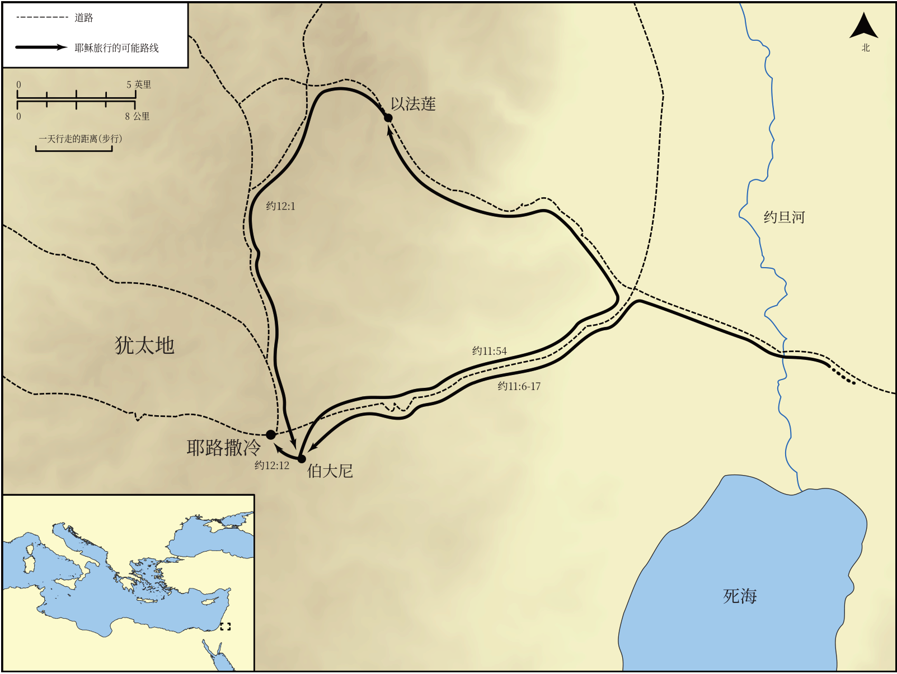

# Biblica 开放圣经地图

## License Information

Biblica Open Bible Maps, © 2023–2025 Biblica, Inc. This work is licensed under Creative Commons Attribution-ShareAlike 4.0 International (<a href="https://creativecommons.org/licenses/by-sa/4.0/">https://creativecommons.org/licenses/by-sa/4.0/</a>). More Information: <a href="https://docs.google.com/document/d/1Pp44yZ0Zdnd59vJHTrt2rPYq0SppfX5rZbPBt6mz37U/edit?tab=t.0#heading=h.oev9aj1ksvk2">https://docs.google.com/document/d/1Pp44yZ0Zdnd59vJHTrt2rPYq0SppfX5rZbPBt6mz37U/edit?tab=t.0#heading=h.oev9aj1ksvk2</a>

--------------------------------

## 耶稣的生平：约翰福音中耶稣最后一次前往耶路撒冷 (id: NT017)

### Image Content

[link](images/NT017.png)

* **Associated Passages:** 约翰福音 11:1-12:50

* **Associated ACAI Concepts:** Jesus (ID: `person:Jesus.2`); Believe (ID: `keyterm:Believe`); LORD (ID: `deity:Lord`); Lazarus (ID: `person:Lazarus.2`); Jews (ID: `group:Jews`); Mary (ID: `person:Mary.3`); Martha (ID: `person:Martha`); Glory (ID: `keyterm:Glory`); Ability (ID: `keyterm:Ability`); Be a Disciple (ID: `keyterm:Disciple`); Resurrection (ID: `keyterm:Resurrection`); Pharisees (ID: `group:Pharisee`); Always (ID: `keyterm:Always`); Jerusalem (ID: `place:Jerusalem`); Life (ID: `keyterm:Life`); Bethany (ID: `place:Bethany`); Commandment (ID: `keyterm:Commandment`); Salvation (ID: `keyterm:Salvation`); Isaiah (ID: `person:Isaiah`); Friendship (ID: `keyterm:Friendship`); Symbol (ID: `keyterm:Example`); Grave (ID: `realia:Grave`); Passover (ID: `keyterm:Passover`); Stumble (ID: `keyterm:Stumble`); Philip (ID: `person:Philip`); A Group of Disciples (ID: `group:GenericDisciples`); Word (ID: `keyterm:Word`); A Group of People (ID: `group:GenericGroup`); Decided (ID: `keyterm:Decided`); Pure (ID: `keyterm:Pure`)
