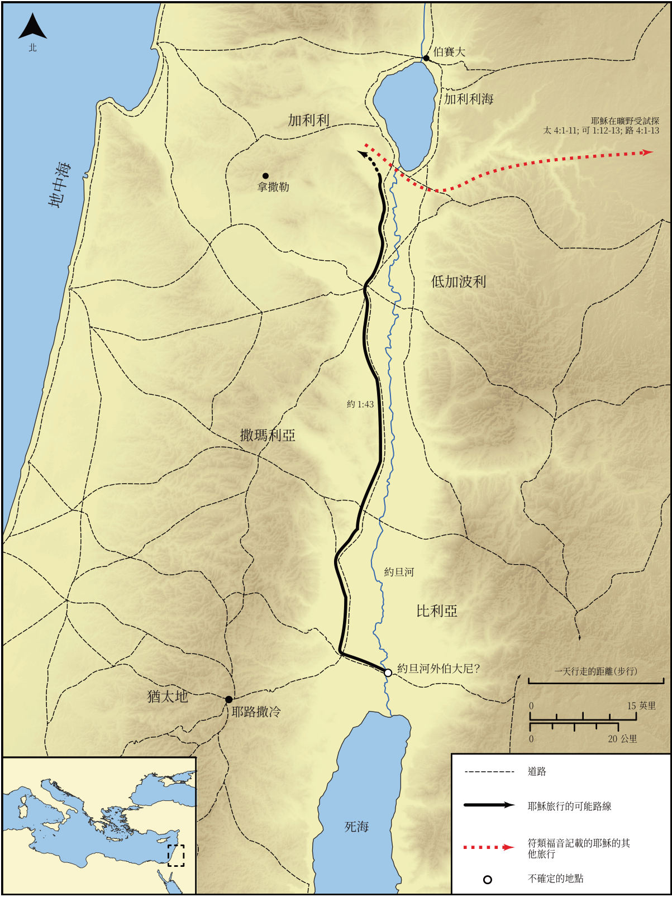

# Biblica 開放聖經地圖

## License Information

Biblica Open Bible Maps, © 2023–2025 Biblica, Inc. This work is licensed under Creative Commons Attribution-ShareAlike 4.0 International (<a href="https://creativecommons.org/licenses/by-sa/4.0/">https://creativecommons.org/licenses/by-sa/4.0/</a>). More Information: <a href="https://docs.google.com/document/d/1Pp44yZ0Zdnd59vJHTrt2rPYq0SppfX5rZbPBt6mz37U/edit?tab=t.0#heading=h.oev9aj1ksvk2">https://docs.google.com/document/d/1Pp44yZ0Zdnd59vJHTrt2rPYq0SppfX5rZbPBt6mz37U/edit?tab=t.0#heading=h.oev9aj1ksvk2</a>

--------------------------------

## 耶穌的生平：耶穌受洗並前往加利利 (id: NT011)

### Image Content

[link](images/NT011.png)

* **Associated Passages:** 約翰福音 1:1-51

* **Associated ACAI Concepts:** Jesus (ID: `person:Jesus.2`); LORD (ID: `deity:Lord`); John (ID: `person:John`); Bear Witness (ID: `keyterm:BearWitness`); Nathanael (ID: `person:Nathanael`); Philip (ID: `person:Philip`); Baptism (ID: `keyterm:Baptism`); Ability (ID: `keyterm:Ability`); Peter (ID: `person:Peter`); Favor (ID: `keyterm:Favor`); Ask for (ID: `keyterm:AskFor`); Israel (ID: `person:Israel`); Believe (ID: `keyterm:Believe`); True (ID: `keyterm:True`); Nazareth (ID: `place:Nazareth`); Andrew (ID: `person:Andrew`); Law (ID: `keyterm:Law`); Moses (ID: `person:Moses`); Be a Disciple (ID: `keyterm:Disciple`); Sky (ID: `keyterm:Heaven`); Elijah (ID: `person:Elijah`); Name (ID: `keyterm:Name`); Truth (ID: `keyterm:Truth`); Body (ID: `keyterm:Body.3`); Holy Spirit (ID: `deity:HolySpirit`); Bethany (ID: `place:Bethany.2`); A Disciple (ID: `person:GenericDisciple`); John (ID: `person:John.4`); Life (ID: `keyterm:Life`); Bethsaida (ID: `place:Bethsaida`)
