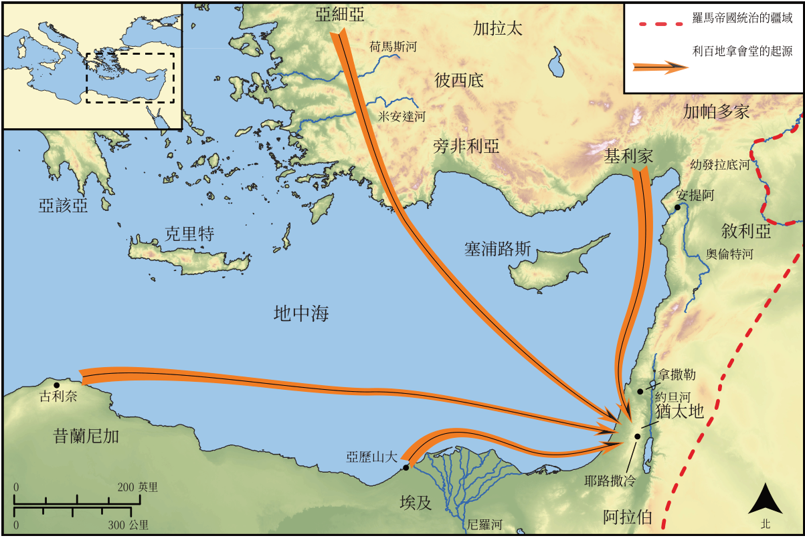

# Biblica 開放聖經地圖

## License Information

Biblica Open Bible Maps, © 2023–2025 Biblica, Inc. This work is licensed under Creative Commons Attribution-ShareAlike 4.0 International (https://creativecommons.org/licenses/by-sa/4.0/). More Information: https://docs.google.com/document/d/1Pp44yZ0Zdnd59vJHTrt2rPYq0SppfX5rZbPBt6mz37U/edit?tab=t.0#heading=h.oev9aj1ksvk2

--------------------------------

## 保羅與早期教會：司提反的反對者 (id: NT032)

### Image Content

[link](images/NT032.png)

* **Associated Passages:** 使徒行傳 6:1-15

* **Associated ACAI Concepts:** Stephen (ID: `person:Stephen`); Serve (ID: `keyterm:Serve`); LORD (ID: `deity:Lord`); Holy Spirit (ID: `deity:HolySpirit`); Be a Disciple (ID: `keyterm:Disciple`); Word (ID: `keyterm:Word`); Spirit (ID: `keyterm:Spirit.2`); Pray (ID: `keyterm:Pray`); Believe (ID: `keyterm:Believe`); Moses (ID: `person:Moses`); Philip (ID: `person:Philip.4`); Alexandrians (ID: `group:Alexandria`); Parmenas (ID: `person:Parmenas`); Prochorus (ID: `person:Prochorus`); Hellenists (ID: `group:Hellenist`); Nicanor (ID: `person:Nicanor`); Alexandria (ID: `place:Alexandria`); Freedmen (ID: `group:Freedmen`); Timon (ID: `person:Timon`); Antiochians (ID: `group:Antioch`); Nicolaus (ID: `person:Nicolaus`); Asia (ID: `place:Asia`); Witness (ID: `keyterm:Witness`); Holy (ID: `keyterm:Holy`); An Angel (ID: `deity:Angel`); Portent (ID: `keyterm:Portent`); Jesus (ID: `person:Jesus.2`); Ability (ID: `keyterm:Ability`); Symbol (ID: `keyterm:Example`); Favor (ID: `keyterm:Favor`); A Group of Disciples (ID: `group:GenericDisciples`); Bear Witness (ID: `keyterm:BearWitness`); Greece (ID: `place:Greece`); Hebrews (ID: `group:Hebrews`); Blasphemous (ID: `keyterm:Blasphemous`); Chosen (ID: `keyterm:Chosen`); Cilicia (ID: `place:Cilicia`); Jerusalem (ID: `place:Jerusalem`); Antioch (ID: `place:Antioch`); Cyrene (ID: `place:Cyrene`); Nazareth (ID: `place:Nazareth`); Law (ID: `keyterm:Law`); Tabernacle (ID: `realia:Tabernacle`)
