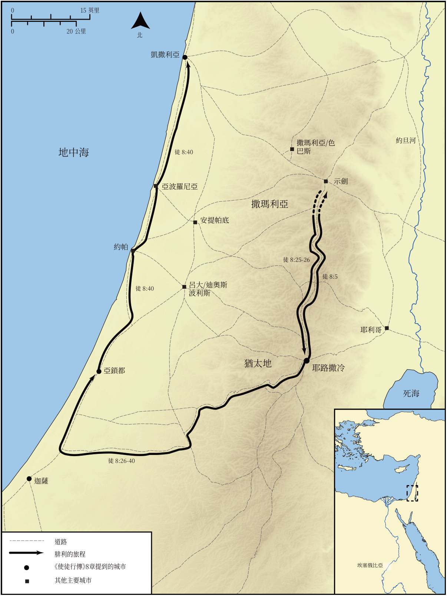

# Biblica 開放聖經地圖

## License Information

Biblica Open Bible Maps, © 2023–2025 Biblica, Inc. This work is licensed under Creative Commons Attribution-ShareAlike 4.0 International (<a href="https://creativecommons.org/licenses/by-sa/4.0/">https://creativecommons.org/licenses/by-sa/4.0/</a>). More Information: <a href="https://docs.google.com/document/d/1Pp44yZ0Zdnd59vJHTrt2rPYq0SppfX5rZbPBt6mz37U/edit?tab=t.0#heading=h.oev9aj1ksvk2">https://docs.google.com/document/d/1Pp44yZ0Zdnd59vJHTrt2rPYq0SppfX5rZbPBt6mz37U/edit?tab=t.0#heading=h.oev9aj1ksvk2</a>

--------------------------------

## 保羅與早期教會：腓利的旅程 (id: NT034)

### Image Content

[link](images/NT034.png)

* **Associated Passages:** 使徒行傳 8:1-40

* **Associated ACAI Concepts:** Philip (ID: `person:Philip.4`); LORD (ID: `deity:Lord`); Holy Spirit (ID: `deity:HolySpirit`); Jerusalem (ID: `place:Jerusalem`); Good News (ID: `keyterm:GoodNews`); Samaria (ID: `place:Samaria`); Baptism (ID: `keyterm:Baptism`); Jesus (ID: `person:Jesus.2`); Ask for (ID: `keyterm:AskFor`); Simon (ID: `person:Simon.8`); Ability (ID: `keyterm:Ability`); Public Official (ID: `person:GenericOfficial`); Name (ID: `keyterm:Name`); Chariot (ID: `realia:Chariot`); Peter (ID: `person:Peter`); Church (ID: `keyterm:Church`); Symbol (ID: `keyterm:Example`); Written (ID: `keyterm:Scripture`); Isaiah (ID: `person:Isaiah`); Believe (ID: `keyterm:Believe`); Paul (ID: `person:Paul`); Heart (ID: `keyterm:Heart`); Money (ID: `realia:Money`); Ethiopians (ID: `group:Ethiopia`); Ethiopia (ID: `place:Ethiopia`); Ashdod (ID: `place:Ashdod`); Proclaim (ID: `keyterm:Proclaim`); Gaza (ID: `place:Gaza`); Stephen (ID: `person:Stephen`); Judea (ID: `place:Judea`); Unjust Deed (ID: `keyterm:UnjustDeed`); Serve (ID: `keyterm:Serve`); John (ID: `person:John.2`); Cause of Joy (ID: `keyterm:CauseOfJoy`); Kingdom (ID: `keyterm:Kingdom`); An Angel (ID: `deity:Angel`); Declare (ID: `keyterm:Declare`); Samaritans (ID: `group:Samaritan`); Pray (ID: `keyterm:Pray`); Caesarea (ID: `place:Caesarea`); Simon (ID: `person:Simon.9`); Authority (ID: `keyterm:Authority.2`); Life (ID: `keyterm:Life`); Repent (ID: `keyterm:Repent`); Straightness (ID: `keyterm:Straightness`); Bow Down (ID: `keyterm:BowDown`); Forgive (ID: `keyterm:Forgive`); Sheep (ID: `fauna:Lamb`); Temple (ID: `realia:Temple`); House (ID: `realia:House`); Prison (ID: `realia:Prison`)
