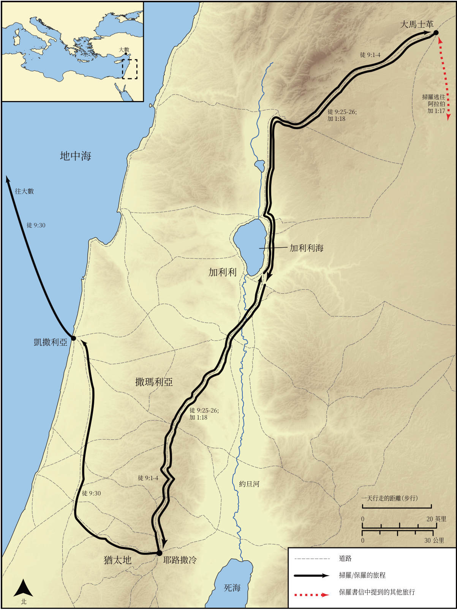

# Biblica 開放聖經地圖

## License Information

Biblica Open Bible Maps, © 2023–2025 Biblica, Inc. This work is licensed under Creative Commons Attribution-ShareAlike 4.0 International (https://creativecommons.org/licenses/by-sa/4.0/). More Information: https://docs.google.com/document/d/1Pp44yZ0Zdnd59vJHTrt2rPYq0SppfX5rZbPBt6mz37U/edit?tab=t.0#heading=h.oev9aj1ksvk2

--------------------------------

## 保羅與早期教會：保羅的歸信 (id: NT035)

### Image Content

[link](images/NT035.png)

* **Associated Passages:** 使徒行傳 9:1-43

* **Associated ACAI Concepts:** Jesus (ID: `person:Jesus.2`); Name (ID: `keyterm:Name`); Paul (ID: `person:Paul`); Damascus (ID: `place:Damascus`); Be a Disciple (ID: `keyterm:Disciple`); Peter (ID: `person:Peter`); Jerusalem (ID: `place:Jerusalem`); Ananias (ID: `person:Ananias.2`); Joppa (ID: `place:Joppa`); Tabitha (ID: `person:Tabitha`); Holy (ID: `keyterm:Holy`); Lod (ID: `place:Lod`); Aeneas (ID: `person:Aeneas`); Tarsus (ID: `place:Tarsus`); Call Upon (ID: `keyterm:CallUpon`); Ask for (ID: `keyterm:AskFor`); Holy Spirit (ID: `deity:HolySpirit`); Jews (ID: `group:Jews`); Pray (ID: `keyterm:Pray`); Believe (ID: `keyterm:Believe`); Fear (ID: `keyterm:Fear`); Straight Street (ID: `place:Straight`); Tarsians (ID: `group:Tarsus`); Hellenists (ID: `group:Hellenist`); Sharon Plain (ID: `place:Sharon.2`); The Way (ID: `keyterm:TheWay`); Simon (ID: `person:Simon.9`); Judas (ID: `person:Judas.4`); House (ID: `realia:House`); Upstairs Room (ID: `realia:UpstairsRoom`); Make Peace (ID: `keyterm:Peace`); Israel (ID: `person:Israel`); Baptism (ID: `keyterm:Baptism`); Gentiles (ID: `group:Gentile`); Ability (ID: `keyterm:Ability`); Good (ID: `keyterm:Good`); Greece (ID: `place:Greece`); Authority (ID: `keyterm:Authority.2`); Proclaim (ID: `keyterm:Proclaim`); Galilee (ID: `place:Galilee`); Church (ID: `keyterm:Church`); Barnabas (ID: `person:Barnabas`); Body (ID: `keyterm:Body.3`); Samaria (ID: `place:Samaria`); Chosen (ID: `keyterm:Chosen`); Sky (ID: `keyterm:Heaven`); Straightness (ID: `keyterm:Straightness`); Life (ID: `keyterm:Life`); Caesarea (ID: `place:Caesarea`); Judea (ID: `place:Judea`); Basket (ID: `realia:Basket`); Cloak (ID: `realia:Cloak`); Tunic (ID: `realia:Tunic.2`); Leather (ID: `realia:Leather`); Bed (ID: `realia:Bed`); Temple (ID: `realia:Temple`); City Wall (ID: `realia:CityWall`); Synagogue (ID: `realia:Synagogue`)
