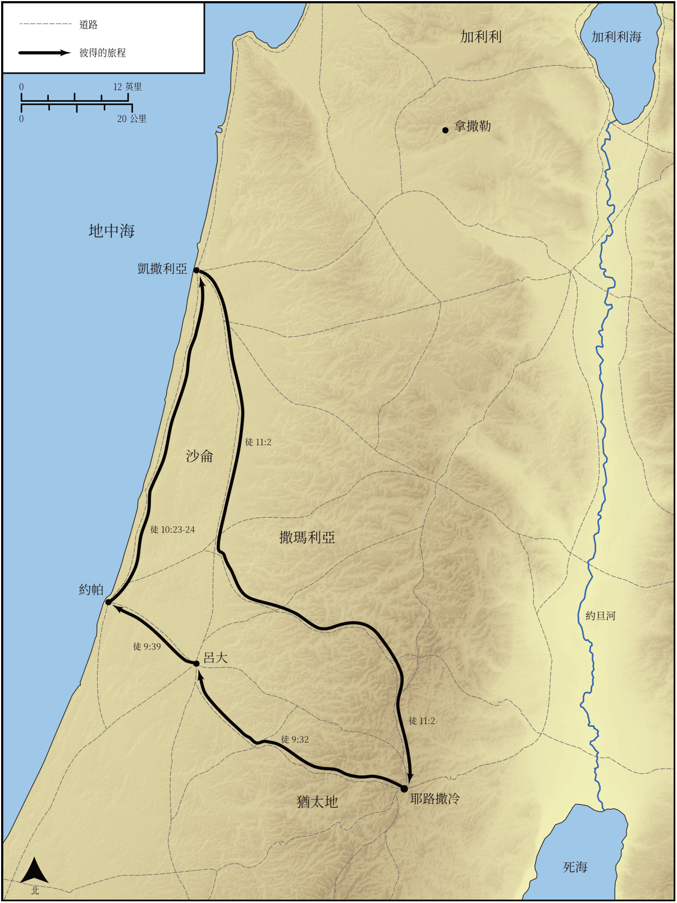

# Biblica 開放聖經地圖

## License Information

Biblica Open Bible Maps, © 2023–2025 Biblica, Inc. This work is licensed under Creative Commons Attribution-ShareAlike 4.0 International (<a href="https://creativecommons.org/licenses/by-sa/4.0/">https://creativecommons.org/licenses/by-sa/4.0/</a>). More Information: <a href="https://docs.google.com/document/d/1Pp44yZ0Zdnd59vJHTrt2rPYq0SppfX5rZbPBt6mz37U/edit?tab=t.0#heading=h.oev9aj1ksvk2">https://docs.google.com/document/d/1Pp44yZ0Zdnd59vJHTrt2rPYq0SppfX5rZbPBt6mz37U/edit?tab=t.0#heading=h.oev9aj1ksvk2</a>

--------------------------------

## 保羅與早期教會：彼得的旅程 (id: NT036)

### Image Content

[link](images/NT036.png)

* **Associated Passages:** 使徒行傳 9:1-11:30

* **Associated ACAI Concepts:** Peter (ID: `person:Peter`); LORD (ID: `deity:Lord`); Jesus (ID: `person:Jesus.2`); Name (ID: `keyterm:Name`); Paul (ID: `person:Paul`); Holy Spirit (ID: `deity:HolySpirit`); Cornelius (ID: `person:Cornelius`); Joppa (ID: `place:Joppa`); Be a Disciple (ID: `keyterm:Disciple`); Jerusalem (ID: `place:Jerusalem`); Damascus (ID: `place:Damascus`); Sky (ID: `keyterm:Heaven`); Pray (ID: `keyterm:Pray`); Jews (ID: `group:Jews`); Believe (ID: `keyterm:Believe`); Antioch (ID: `place:Antioch`); Defilement (ID: `keyterm:Defilement`); Word (ID: `keyterm:Word`); Baptism (ID: `keyterm:Baptism`); Ask for (ID: `keyterm:AskFor`); An Angel (ID: `deity:Angel`); Fear (ID: `keyterm:Fear`); House (ID: `realia:House`); Ananias (ID: `person:Ananias.2`); Simon (ID: `person:Simon.9`); Gentiles (ID: `group:Gentile`); Holy (ID: `keyterm:Holy`); Judea (ID: `place:Judea`); Caesarea (ID: `place:Caesarea`); Temple (ID: `realia:Temple`)
