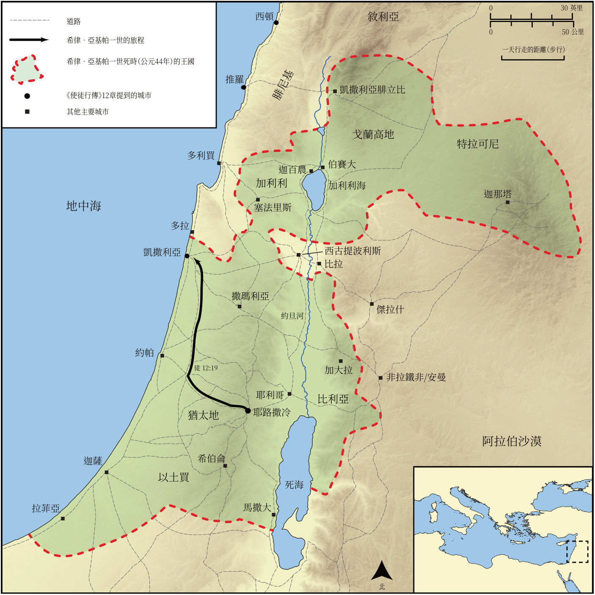

# Biblica 開放聖經地圖

## License Information

Biblica Open Bible Maps, © 2023–2025 Biblica, Inc. This work is licensed under Creative Commons Attribution-ShareAlike 4.0 International (https://creativecommons.org/licenses/by-sa/4.0/). More Information: https://docs.google.com/document/d/1Pp44yZ0Zdnd59vJHTrt2rPYq0SppfX5rZbPBt6mz37U/edit?tab=t.0#heading=h.oev9aj1ksvk2

--------------------------------

## 保羅與早期教會：希律亞基帕一世之死 (id: NT038)

### Image Content

[link](images/NT038.png)

* **Associated Passages:** 使徒行傳 12:1-25

* **Associated ACAI Concepts:** Peter (ID: `person:Peter`); An Angel (ID: `deity:Angel`); Herod (ID: `person:Herod.3`); LORD (ID: `deity:Lord`); Prison (ID: `realia:Prison`); Mark (ID: `person:Mark`); Jews (ID: `group:Jews`); True (ID: `keyterm:True`); Pray (ID: `keyterm:Pray`); Church (ID: `keyterm:Church`); A Group of People (ID: `group:GenericGroup`); Chain (ID: `realia:Chain`); James (ID: `person:James`); Tyrians (ID: `group:Tyre`); Mary (ID: `person:Mary.5`); Blastus (ID: `person:Blastus`); Rhoda (ID: `person:Rhoda`); Door (ID: `realia:Door`); John (ID: `person:John.2`); Temple (ID: `realia:Temple`); Make Peace (ID: `keyterm:Peace`); Glory (ID: `keyterm:Glory`); James (ID: `person:James.3`); Cause of Joy (ID: `keyterm:CauseOfJoy`); Serve (ID: `keyterm:Serve`); Discern (ID: `keyterm:Discern`); Sidon (ID: `place:Sidon`); Barnabas (ID: `person:Barnabas`); Rescue (ID: `keyterm:Rescue`); Paul (ID: `person:Paul`); Tyre (ID: `place:Tyre`); Sidonians (ID: `group:Sidon`); Passover (ID: `keyterm:Passover`); Name (ID: `keyterm:Name`); Jerusalem (ID: `place:Jerusalem`); Caesarea (ID: `place:Caesarea`); Persuade (ID: `keyterm:Persuade`); Judea (ID: `place:Judea`); Bedroom (ID: `realia:Bedroom`); Entrance (ID: `realia:Entrance`); Clothing (ID: `realia:Clothing`); Cloak (ID: `realia:Cloak`); Judgment Seat (ID: `realia:JudgmentSeat`); Worm (ID: `fauna:Maggot`); House (ID: `realia:House`); Sandal (ID: `realia:Sandal`)
