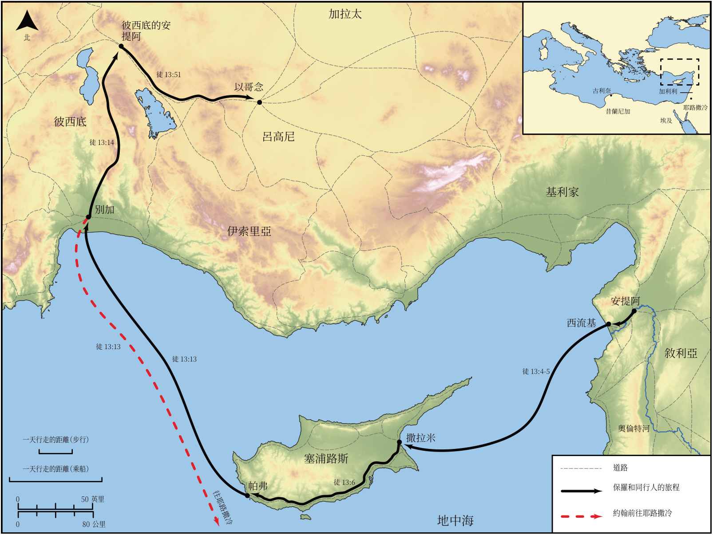

# Biblica 開放聖經地圖

## License Information

Biblica Open Bible Maps, © 2023–2025 Biblica, Inc. This work is licensed under Creative Commons Attribution-ShareAlike 4.0 International (https://creativecommons.org/licenses/by-sa/4.0/). More Information: https://docs.google.com/document/d/1Pp44yZ0Zdnd59vJHTrt2rPYq0SppfX5rZbPBt6mz37U/edit?tab=t.0#heading=h.oev9aj1ksvk2

--------------------------------

## 保羅與早期教會：保羅第一次傳教旅程（第一部分） (id: NT039)

### Image Content

[link](images/NT039.png)

* **Associated Passages:** 使徒行傳 13:1-52

* **Associated ACAI Concepts:** LORD (ID: `deity:Lord`); Paul (ID: `person:Paul`); Barnabas (ID: `person:Barnabas`); Jews (ID: `group:Jews`); Believe (ID: `keyterm:Believe`); Holy Spirit (ID: `deity:HolySpirit`); Sabbath (ID: `keyterm:Sabbath`); Israel (ID: `person:Israel`); Gentiles (ID: `group:Gentile`); David (ID: `person:David`); Jerusalem (ID: `place:Jerusalem`); Paphos (ID: `place:Paphos`); Bar-jesus (ID: `person:Bar-jesus`); Worship (ID: `keyterm:Worship`); Perga (ID: `place:Perga`); Abstain from Food (ID: `keyterm:Fast`); Synagogue (ID: `realia:Synagogue`); Law (ID: `keyterm:Law`); Ask for (ID: `keyterm:AskFor`); Salvation (ID: `keyterm:Salvation`); Life (ID: `keyterm:Life`); Decided (ID: `keyterm:Decided`); Name (ID: `keyterm:Name`); Fear (ID: `keyterm:Fear`); Holy (ID: `keyterm:Holy`); John (ID: `person:John`); Mark (ID: `person:Mark`); Resurrection (ID: `keyterm:Resurrection`); Promise (ID: `keyterm:Promise`); Always (ID: `keyterm:Always`)
