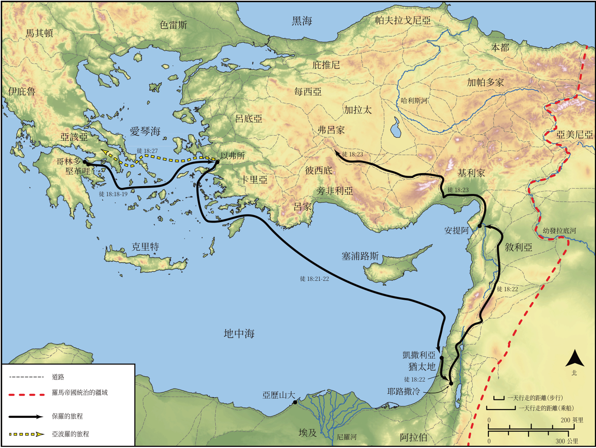

# Biblica 開放聖經地圖

## License Information

Biblica Open Bible Maps, © 2023–2025 Biblica, Inc. This work is licensed under Creative Commons Attribution-ShareAlike 4.0 International (https://creativecommons.org/licenses/by-sa/4.0/). More Information: https://docs.google.com/document/d/1Pp44yZ0Zdnd59vJHTrt2rPYq0SppfX5rZbPBt6mz37U/edit?tab=t.0#heading=h.oev9aj1ksvk2

--------------------------------

## 保羅與早期教會：保羅第二次傳教旅程的結束與第三次旅程的開始 (id: NT044)

### Image Content

[link](images/NT044.png)

* **Associated Passages:** 使徒行傳 18:1-28

* **Associated ACAI Concepts:** Jews (ID: `group:Jews`); LORD (ID: `deity:Lord`); Paul (ID: `person:Paul`); Synagogue (ID: `realia:Synagogue`); Name (ID: `keyterm:Name`); Gallio (ID: `person:Gallio`); Aquila (ID: `person:Aquila`); Priscilla (ID: `person:Priscilla`); Jesus (ID: `person:Jesus.2`); Ephesus (ID: `place:Ephesus`); Judgment Seat (ID: `realia:JudgmentSeat`); Worship (ID: `keyterm:Worship`); Corinth (ID: `place:Corinth`); Achaia (ID: `place:Achaia`); Baptism (ID: `keyterm:Baptism`); The Way (ID: `keyterm:TheWay`); Believe (ID: `keyterm:Believe`); Written (ID: `keyterm:Scripture`); Be a Disciple (ID: `keyterm:Disciple`); Law (ID: `keyterm:Law`); Pontus (ID: `place:Pontus`); Cenchreae (ID: `place:Cenchreae`); Alexandrians (ID: `group:Alexandria`); Justus (ID: `person:Justus.2`); Claudius (ID: `person:Claudius`); Galatia (ID: `place:Galatia`); Crispus (ID: `person:Crispus`); Alexandria (ID: `place:Alexandria`); Pontus (ID: `group:Pontus`); Apollos (ID: `person:Apollos`); Phrygia (ID: `place:Phrygia`); Rome (ID: `place:Rome`); Corinthians (ID: `group:Corinth`); Sosthenes (ID: `person:Sosthenes`); Declare (ID: `keyterm:Declare`); Javan (ID: `person:Javan`); Ask for (ID: `keyterm:AskFor`); Macedonia (ID: `place:Macedonia`); Blood (ID: `keyterm:Blood`); Unrighteous Act (ID: `keyterm:UnrighteousAct`); Gentiles (ID: `group:Gentile`); Vow (ID: `keyterm:Vow`); Spirit (ID: `keyterm:Spirit.2`); Favor (ID: `keyterm:Favor`); Caesarea (ID: `place:Caesarea`); Silas (ID: `person:Silas`); Greeks (ID: `group:Greek`); Sabbath (ID: `keyterm:Sabbath`); Church (ID: `keyterm:Church`); Clean (ID: `keyterm:Clean`); Persuade (ID: `keyterm:Persuade`); Italy (ID: `place:Italy`); Timothy (ID: `person:Timothy`); John (ID: `person:John`); Blaspheme (ID: `keyterm:Blaspheme`); Fear (ID: `keyterm:Fear`); Athens (ID: `place:Athens`); Antioch (ID: `place:Antioch`); Clothing (ID: `realia:Clothing`); Tent (ID: `realia:Tent`); House (ID: `realia:House`)
