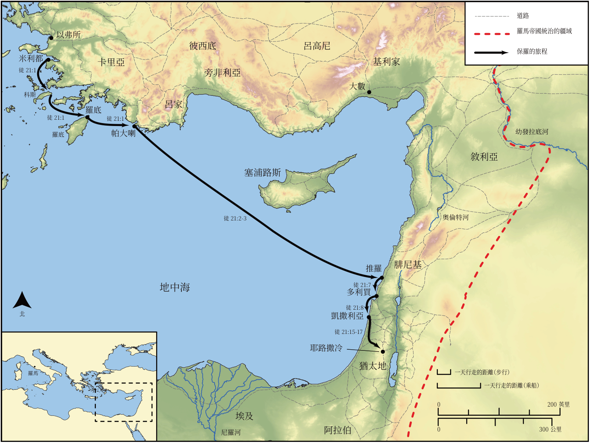

# Biblica 開放聖經地圖

## License Information

Biblica Open Bible Maps, © 2023–2025 Biblica, Inc. This work is licensed under Creative Commons Attribution-ShareAlike 4.0 International (https://creativecommons.org/licenses/by-sa/4.0/). More Information: https://docs.google.com/document/d/1Pp44yZ0Zdnd59vJHTrt2rPYq0SppfX5rZbPBt6mz37U/edit?tab=t.0#heading=h.oev9aj1ksvk2

--------------------------------

## 保羅與早期教會：保羅第三次傳教旅程（第二部分） (id: NT046)

### Image Content

[link](images/NT046.png)

* **Associated Passages:** 使徒行傳 21:1-40

* **Associated ACAI Concepts:** Paul (ID: `person:Paul`); Jerusalem (ID: `place:Jerusalem`); Jews (ID: `group:Jews`); Temple (ID: `realia:Temple`); Gentiles (ID: `group:Gentile`); LORD (ID: `deity:Lord`); Law (ID: `keyterm:Law`); Caesarea (ID: `place:Caesarea`); Ship (ID: `realia:Ship`); Holy Spirit (ID: `deity:HolySpirit`); Believe (ID: `keyterm:Believe`); Tyre (ID: `place:Tyre`); Pure (ID: `keyterm:Pure`); Be a Disciple (ID: `keyterm:Disciple`); Cyprus (ID: `place:Cyprus`); Name (ID: `keyterm:Name`); Step (ID: `realia:Step`); Rhodes (ID: `place:Rhodes`); Agabus (ID: `person:Agabus`); Phoenicia (ID: `place:Phoenicia`); Cypriots (ID: `group:Cyprus`); Tarsians (ID: `group:Tarsus`); Patara (ID: `place:Patara`); Cos (ID: `place:Cos`); Mnason (ID: `person:Mnason`); Philip (ID: `person:Philip.4`); Tarsus (ID: `place:Tarsus`); Trophimus (ID: `person:Trophimus`); Cilicia (ID: `place:Cilicia`); Military Member (ID: `person:MilitaryMember`); Asia (ID: `place:Asia`); Israel (ID: `person:Israel`); Javan (ID: `person:Javan`); Holy (ID: `keyterm:Holy`); Ask for (ID: `keyterm:AskFor`); Blood (ID: `keyterm:Blood`); Glory (ID: `keyterm:Glory`); Fornication (ID: `keyterm:Fornication`); James (ID: `person:James.3`); Vow (ID: `keyterm:Vow`); Jesus (ID: `person:Jesus.2`); Speak as a Prophet (ID: `keyterm:Speak`); Serve (ID: `keyterm:Serve`); Decided (ID: `keyterm:Decided`); Israelites (ID: `group:Israel`); Be Lawful (ID: `keyterm:Lawful`); Pray (ID: `keyterm:Pray`); Ephesus (ID: `place:Ephesus`); Egypt (ID: `place:Egypt`); Offering (ID: `keyterm:Offering`); Ephesians (ID: `group:Ephesus`); Greeks (ID: `group:Greek`); Acco (ID: `place:Acco`); Live (ID: `keyterm:Live.3`); Moses (ID: `person:Moses`); Something Definite (ID: `keyterm:SomethingDefinite`); Heart (ID: `keyterm:Heart`); Defilement (ID: `keyterm:Defilement`); Egyptians (ID: `group:Egypt`); Persuade (ID: `keyterm:Persuade`); Judea (ID: `place:Judea`); Belt (ID: `realia:Belt`); Door (ID: `realia:Door`); Chain (ID: `realia:Chain`); Bag (ID: `realia:Bag`); Tabernacle (ID: `realia:Tabernacle`); House (ID: `realia:House`)
