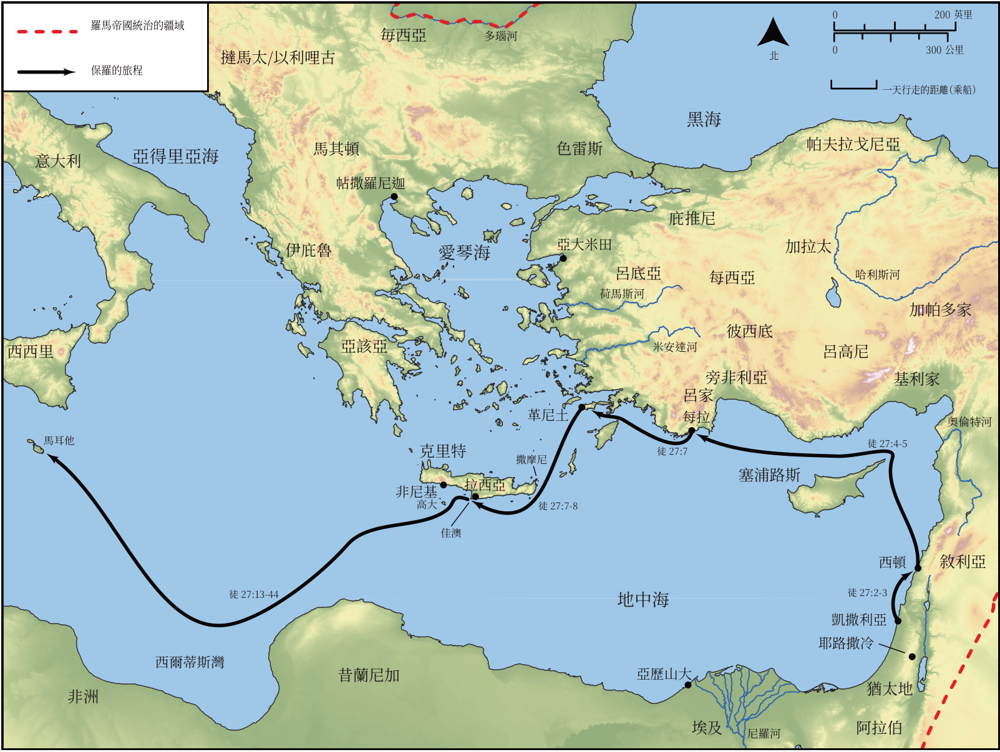

# Biblica 開放聖經地圖

## License Information

Biblica Open Bible Maps, © 2023–2025 Biblica, Inc. This work is licensed under Creative Commons Attribution-ShareAlike 4.0 International (https://creativecommons.org/licenses/by-sa/4.0/). More Information: https://docs.google.com/document/d/1Pp44yZ0Zdnd59vJHTrt2rPYq0SppfX5rZbPBt6mz37U/edit?tab=t.0#heading=h.oev9aj1ksvk2

--------------------------------

## 保羅與早期教會：保羅前往羅馬的旅程（第一部分） (id: NT048)

### Image Content

[link](images/NT048.png)

* **Associated Passages:** 使徒行傳 27:1-44

* **Associated ACAI Concepts:** Ship (ID: `realia:Ship`); Paul (ID: `person:Paul`); Salvation (ID: `keyterm:Salvation`); Crete (ID: `place:Crete`); LORD (ID: `deity:Lord`); Fear (ID: `keyterm:Fear`); Anchor (ID: `realia:Anchor`); Julius (ID: `person:Julius`); Italy (ID: `place:Italy`); Ask for (ID: `keyterm:AskFor`); Life (ID: `keyterm:Life`); Fair Havens (ID: `place:FairHavens`); Asia (ID: `place:Asia`); Aristarchus (ID: `person:Aristarchus`); Adramyttium (ID: `place:Adramyttium`); Augustus (ID: `person:Augustus`); Salmone (ID: `place:Salmone`); Lasea (ID: `place:Lasea`); Myra (ID: `place:Myra`); Cnidus (ID: `place:Cnidus`); Sidon (ID: `place:Sidon`); Alexandria (ID: `place:Alexandria`); Adriatic Sea (ID: `place:AdriaticSea`); the Syrtis (ID: `place:Syrtis`); Pamphylia (ID: `place:Pamphylia`); Cilicia (ID: `place:Cilicia`); Lycia (ID: `place:Lycia`); Phoenix (ID: `place:Phoenix`); Cauda (ID: `place:Cauda`); Rope (ID: `realia:Rope`); Abstain from Food (ID: `keyterm:Fast`); Forgive (ID: `keyterm:Forgive`); An Angel (ID: `deity:Angel`); Macedonia (ID: `place:Macedonia`); Hope (ID: `keyterm:Hope`); Priesthood (ID: `keyterm:Priesthood`); Serve (ID: `keyterm:Serve`); Decided (ID: `keyterm:Decided`); Pray (ID: `keyterm:Pray`); Claudius (ID: `person:Claudius`); Thessalonians (ID: `group:Thessalonica`); Believe (ID: `keyterm:Believe`); Thessalonica (ID: `place:Thessalonica`); Cyprus (ID: `place:Cyprus`); Name (ID: `keyterm:Name`); Persuade (ID: `keyterm:Persuade`); Fathom (ID: `realia:Fathom`); Sail (ID: `realia:Sail`); Rudder (ID: `realia:Rudder`); Wheat (ID: `flora:Wheat`)
