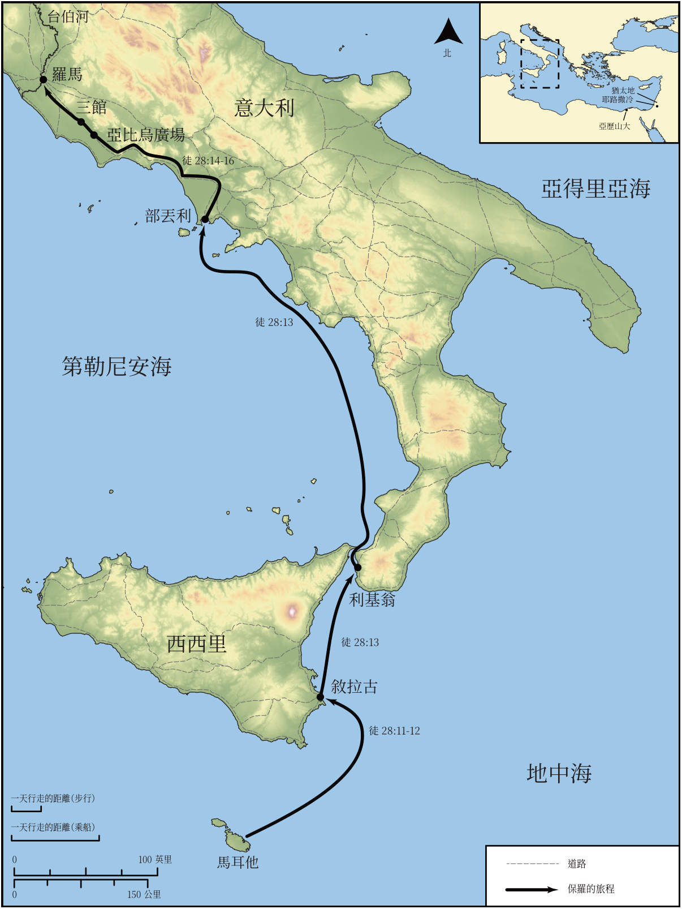

# Biblica 開放聖經地圖

## License Information

Biblica Open Bible Maps, © 2023–2025 Biblica, Inc. This work is licensed under Creative Commons Attribution-ShareAlike 4.0 International (https://creativecommons.org/licenses/by-sa/4.0/). More Information: https://docs.google.com/document/d/1Pp44yZ0Zdnd59vJHTrt2rPYq0SppfX5rZbPBt6mz37U/edit?tab=t.0#heading=h.oev9aj1ksvk2

--------------------------------

## 保羅與早期教會：保羅前往羅馬的旅程（第二部分） (id: NT049)

### Image Content

[link](images/NT049.png)

* **Associated Passages:** 使徒行傳 28:1-31

* **Associated ACAI Concepts:** Paul (ID: `person:Paul`); LORD (ID: `deity:Lord`); Rome (ID: `place:Rome`); Salvation (ID: `keyterm:Salvation`); Publius (ID: `person:Publius`); Persuade (ID: `keyterm:Persuade`); Ask for (ID: `keyterm:AskFor`); Kingdom (ID: `keyterm:Kingdom`); Jews (ID: `group:Jews`); Jesus (ID: `person:Jesus.2`); Rhegium (ID: `place:Rhegium`); Forum of Appius (ID: `place:ForumOfAppius`); Three Taverns (ID: `place:ThreeTaverns`); Puteoli (ID: `place:Puteoli`); Alexandria (ID: `place:Alexandria`); Syracuse (ID: `place:Syracuse`); Malta (ID: `place:Malta`); Declare (ID: `keyterm:Declare`); Disbelieve (ID: `keyterm:Disbelieve`); Moses (ID: `person:Moses`); Law (ID: `keyterm:Law`); Jerusalem (ID: `place:Jerusalem`); Claudius (ID: `person:Claudius`); Isaiah (ID: `person:Isaiah`); Call Upon (ID: `keyterm:CallUpon`); Proclaim (ID: `keyterm:Proclaim`); Holy Spirit (ID: `deity:HolySpirit`); Word (ID: `keyterm:Word`); Hope (ID: `keyterm:Hope`); Life (ID: `keyterm:Life`); Name (ID: `keyterm:Name`); Be (Or Show Oneself) Just (ID: `keyterm:Just`); Pray (ID: `keyterm:Pray`); Judea (ID: `place:Judea`); Think (ID: `keyterm:Think`); Heart (ID: `keyterm:Heart`); Serve (ID: `keyterm:Serve`); Israel (ID: `person:Israel`); Kindness (ID: `keyterm:Kindness`); Hospitably (ID: `keyterm:Hospitably`); Gentiles (ID: `group:Gentile`); Discern (ID: `keyterm:Discern`); Emblem (ID: `realia:Emblem`); Chain (ID: `realia:Chain`); Snake (ID: `fauna:Snake`); Guest Room (ID: `realia:GuestRoom`); Ship (ID: `realia:Ship`); Cobra (ID: `fauna:Cobra`); Inn (ID: `realia:Inn`)
