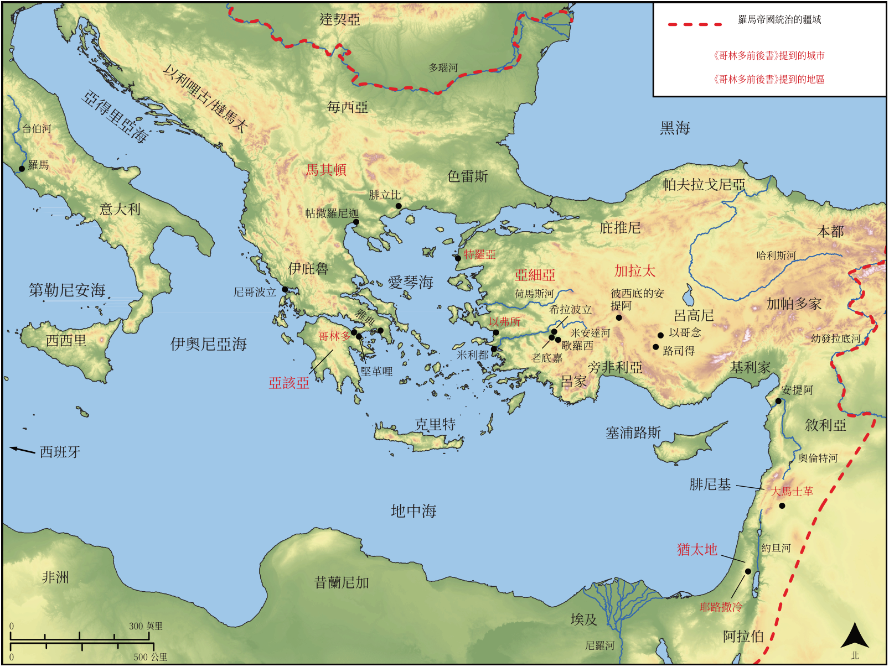

# Biblica 開放聖經地圖

## License Information

Biblica Open Bible Maps, © 2023–2025 Biblica, Inc. This work is licensed under Creative Commons Attribution-ShareAlike 4.0 International (https://creativecommons.org/licenses/by-sa/4.0/). More Information: https://docs.google.com/document/d/1Pp44yZ0Zdnd59vJHTrt2rPYq0SppfX5rZbPBt6mz37U/edit?tab=t.0#heading=h.oev9aj1ksvk2

--------------------------------

## 保羅與早期教會：哥林多書 (id: NT052)

### Image Content

[link](images/NT052.png)

* **Associated Passages:** 哥林多前書 1:1-16:24; 哥林多後書 1:1-13:13

* **Associated ACAI Concepts:** LORD (ID: `deity:Lord`); Jesus (ID: `person:Jesus.2`); Ability (ID: `keyterm:Ability`); Body (ID: `keyterm:Body.3`); Favor (ID: `keyterm:Favor`); Church (ID: `keyterm:Church`); Holy Spirit (ID: `deity:HolySpirit`); Ask for (ID: `keyterm:AskFor`); Love (ID: `keyterm:Love`); Glory (ID: `keyterm:Glory`); Spirit (ID: `keyterm:Spirit.2`); Believe (ID: `keyterm:Believe`); Resurrection (ID: `keyterm:Resurrection`); Good News (ID: `keyterm:GoodNews`); Heart (ID: `keyterm:Heart`); Decided (ID: `keyterm:Decided`); In Christ (ID: `keyterm:InChrist`); Life (ID: `keyterm:Life`); Serve (ID: `keyterm:Serve`); Holy (ID: `keyterm:Holy`); Discern (ID: `keyterm:Discern`); Hope (ID: `keyterm:Hope`); Authority (ID: `keyterm:Authority.2`); Always (ID: `keyterm:Always`); Salvation (ID: `keyterm:Salvation`); To Sin (ID: `keyterm:Sin`); Pray (ID: `keyterm:Pray`); Proclaim (ID: `keyterm:Proclaim`); Speak as a Prophet (ID: `keyterm:Speak`); Conscience (ID: `keyterm:Conscience`)
