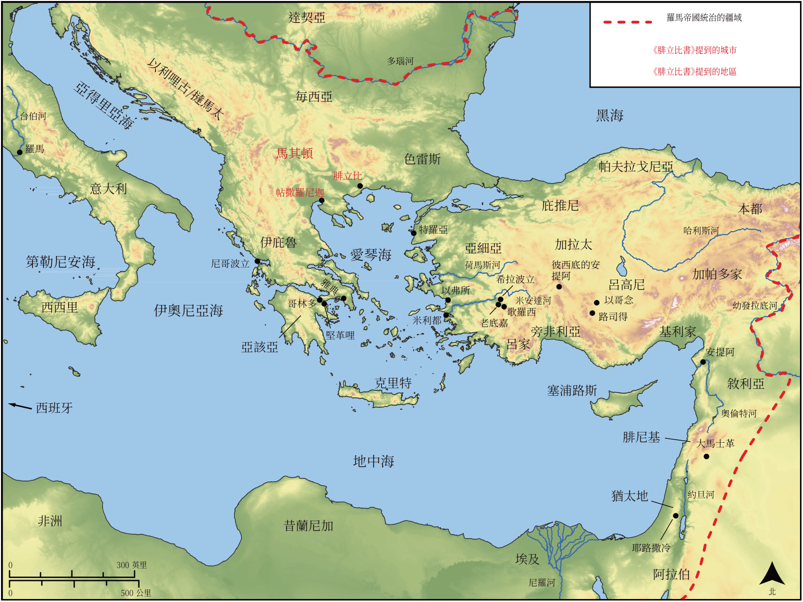

# Biblica 開放聖經地圖

## License Information

Biblica Open Bible Maps, © 2023–2025 Biblica, Inc. This work is licensed under Creative Commons Attribution-ShareAlike 4.0 International (<a href="https://creativecommons.org/licenses/by-sa/4.0/">https://creativecommons.org/licenses/by-sa/4.0/</a>). More Information: <a href="https://docs.google.com/document/d/1Pp44yZ0Zdnd59vJHTrt2rPYq0SppfX5rZbPBt6mz37U/edit?tab=t.0#heading=h.oev9aj1ksvk2">https://docs.google.com/document/d/1Pp44yZ0Zdnd59vJHTrt2rPYq0SppfX5rZbPBt6mz37U/edit?tab=t.0#heading=h.oev9aj1ksvk2</a>

--------------------------------

## 保羅與早期教會：腓立比書 (id: NT054)

### Image Content

[link](images/NT054.png)

* **Associated Passages:** 腓立比書 1:1-4:23

* **Associated ACAI Concepts:** Jesus (ID: `person:Jesus.2`); LORD (ID: `deity:Lord`); In Christ (ID: `keyterm:InChrist`); Heart (ID: `keyterm:Heart`); Good News (ID: `keyterm:GoodNews`); Think (ID: `keyterm:Think`); Glory (ID: `keyterm:Glory`); Life (ID: `keyterm:Life`); Persuade (ID: `keyterm:Persuade`); Body (ID: `keyterm:Body.3`); Cause of Joy (ID: `keyterm:CauseOfJoy`); Be (Or Show Oneself) Just (ID: `keyterm:Just`); Believe (ID: `keyterm:Believe`); Pray (ID: `keyterm:Pray`); Love (ID: `keyterm:Love`); Favor (ID: `keyterm:Favor`); Salvation (ID: `keyterm:Salvation`); Spirit (ID: `keyterm:Spirit.2`); Live (ID: `keyterm:Live.3`); Holy (ID: `keyterm:Holy`); Ask for (ID: `keyterm:AskFor`); Hope (ID: `keyterm:Hope`); Name (ID: `keyterm:Name`); Priesthood (ID: `keyterm:Priesthood`); Fellowship (ID: `keyterm:Fellowship`); Pure (ID: `keyterm:Pure`); Make Peace (ID: `keyterm:Peace`); Law (ID: `keyterm:Law`); Holy Spirit (ID: `deity:HolySpirit`); Epaphroditus (ID: `person:Epaphroditus`)
