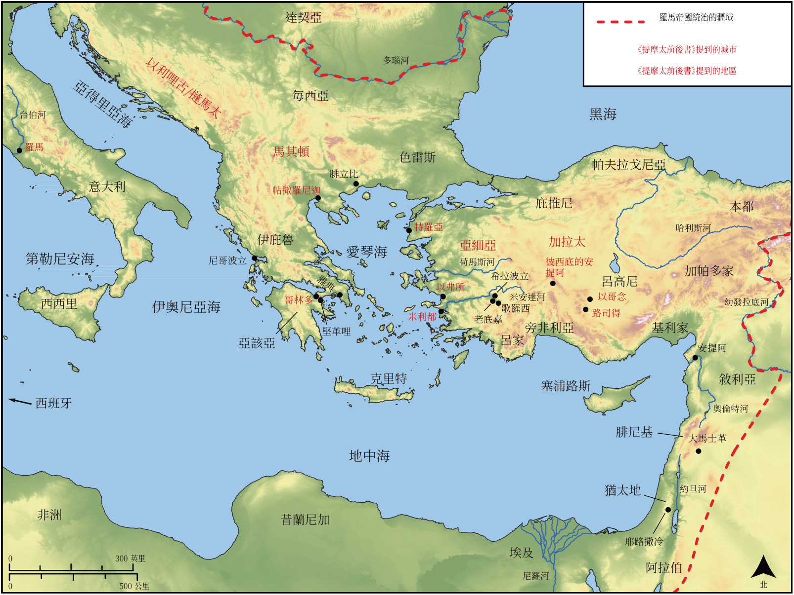

# Biblica 開放聖經地圖

## License Information

Biblica Open Bible Maps, © 2023–2025 Biblica, Inc. This work is licensed under Creative Commons Attribution-ShareAlike 4.0 International (https://creativecommons.org/licenses/by-sa/4.0/). More Information: https://docs.google.com/document/d/1Pp44yZ0Zdnd59vJHTrt2rPYq0SppfX5rZbPBt6mz37U/edit?tab=t.0#heading=h.oev9aj1ksvk2

--------------------------------

## 保羅與早期教會：提摩太書 (id: NT057)

### Image Content

[link](images/NT057.png)

* **Associated Passages:** 提摩太前書 1:1-6:21; 提摩太後書 1:1-4:22

* **Associated ACAI Concepts:** Jesus (ID: `person:Jesus.2`); LORD (ID: `deity:Lord`); Believe (ID: `keyterm:Believe`); Faithfulness (ID: `keyterm:Faithfulness`); Life (ID: `keyterm:Life`); Favor (ID: `keyterm:Favor`); Love (ID: `keyterm:Love`); Truth (ID: `keyterm:Truth`); In Christ (ID: `keyterm:InChrist`); Always (ID: `keyterm:Always`); Ability (ID: `keyterm:Ability`); Salvation (ID: `keyterm:Salvation`); Serve (ID: `keyterm:Serve`); Ask for (ID: `keyterm:AskFor`); Mercy (ID: `keyterm:Mercy`); Be (Or Show Oneself) Just (ID: `keyterm:Just`); Good (ID: `keyterm:Good`); Conscience (ID: `keyterm:Conscience`); Bear Witness (ID: `keyterm:BearWitness`); Glory (ID: `keyterm:Glory`); Hope (ID: `keyterm:Hope`); Timothy (ID: `person:Timothy`); Profane (ID: `keyterm:Profane`); Good News (ID: `keyterm:GoodNews`); Promise (ID: `keyterm:Promise`); To Sin (ID: `keyterm:Sin`); Pray (ID: `keyterm:Pray`); Holy Spirit (ID: `deity:HolySpirit`); Clean (ID: `keyterm:Clean`); Heart (ID: `keyterm:Heart`)
