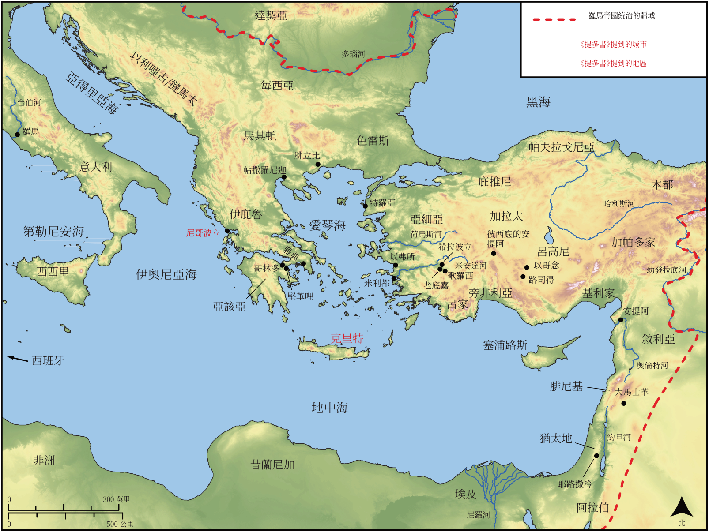

# Biblica 開放聖經地圖

## License Information

Biblica Open Bible Maps, © 2023–2025 Biblica, Inc. This work is licensed under Creative Commons Attribution-ShareAlike 4.0 International (<a href="https://creativecommons.org/licenses/by-sa/4.0/">https://creativecommons.org/licenses/by-sa/4.0/</a>). More Information: <a href="https://docs.google.com/document/d/1Pp44yZ0Zdnd59vJHTrt2rPYq0SppfX5rZbPBt6mz37U/edit?tab=t.0#heading=h.oev9aj1ksvk2">https://docs.google.com/document/d/1Pp44yZ0Zdnd59vJHTrt2rPYq0SppfX5rZbPBt6mz37U/edit?tab=t.0#heading=h.oev9aj1ksvk2</a>

--------------------------------

## 保羅與早期教會：提多書 (id: NT058)

### Image Content

[link](images/NT058.png)

* **Associated Passages:** 提多書 1:1-3:15

* **Associated ACAI Concepts:** LORD (ID: `deity:Lord`); Believe (ID: `keyterm:Believe`); Savior (ID: `keyterm:Savior`); Favor (ID: `keyterm:Favor`); Jesus (ID: `person:Jesus.2`); Good (ID: `keyterm:Good`); Be (Or Show Oneself) Just (ID: `keyterm:Just`); Always (ID: `keyterm:Always`); Ask for (ID: `keyterm:AskFor`); Faithfulness (ID: `keyterm:Faithfulness`); Hope (ID: `keyterm:Hope`); Life (ID: `keyterm:Life`); Without Reproach (ID: `keyterm:WithoutReproach`); Crete (ID: `place:Crete`); Blaspheme (ID: `keyterm:Blaspheme`); Ability (ID: `keyterm:Ability`); Encourage (ID: `keyterm:Encourage`); Truth (ID: `keyterm:Truth`); Salvation (ID: `keyterm:Salvation`); Authority (ID: `keyterm:Authority.2`); Cretans (ID: `group:Cretan`); Clean (ID: `keyterm:Clean`); Cretan Prophet (ID: `person:CretanProphet`); Artemas (ID: `person:Artemas`); Titus (ID: `person:Titus`); Gentle (ID: `keyterm:Gentle`); Worthless (ID: `keyterm:Worthless`); Nicopolis (ID: `place:Nicopolis`); Zenas (ID: `person:Zenas`); Circumcision (ID: `keyterm:Circumcision`); Commandment (ID: `keyterm:Commandment`); Tychicus (ID: `person:Tychicus`); Decided (ID: `keyterm:Decided`); In Common (ID: `keyterm:InCommon`); Liberation (ID: `keyterm:Liberation`); Pure (ID: `keyterm:Pure`); Kindness (ID: `keyterm:Kindness`); Make Peace (ID: `keyterm:Peace`); Jews (ID: `group:Jews`); Promise (ID: `keyterm:Promise`); Liking What Is Good (ID: `keyterm:LikingWhatIsGood`); Defilement (ID: `keyterm:Defilement`); Glory (ID: `keyterm:Glory`); Lawless (ID: `keyterm:Lawless`); Conscience (ID: `keyterm:Conscience`); Holy (ID: `keyterm:Holy`); Be Unfaithful (ID: `keyterm:Unfaithful`); Happy (ID: `keyterm:Happy`); Self-Condemned (ID: `keyterm:SelfCondemned`); Friendship (ID: `keyterm:Friendship`); Proclaim (ID: `keyterm:Proclaim`); Mercy (ID: `keyterm:Mercy`); True (ID: `keyterm:True`); Be Enslaved (ID: `keyterm:Serve.2`); To Cleanse (ID: `keyterm:Cleanse.2`); To Sin (ID: `keyterm:Sin`); Worldly (ID: `keyterm:Worldly`); Love (ID: `keyterm:Love`); Apollos (ID: `person:Apollos`); Beyond Reproach (ID: `keyterm:BeyondReproach`); Chosen (ID: `keyterm:Chosen`); Paul (ID: `person:Paul`); Bear Witness (ID: `keyterm:BearWitness`); Having Love for One's Husband (ID: `keyterm:HavingLoveForOnesHusband`); Holy Spirit (ID: `deity:HolySpirit`); Wine (ID: `realia:Wine`)
